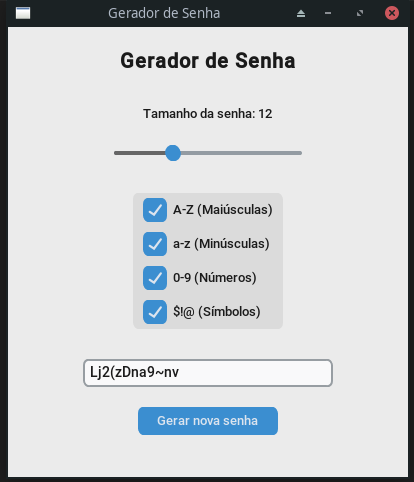

# 🔒 Gerador de Senhas Seguro

Um aplicativo desktop desenvolvido em Python para gerar senhas fortes e aleatórias. O projeto utiliza uma interface gráfica moderna e prioriza a segurança na geração dos caracteres usando a biblioteca `secrets`.


## 📸 Demonstração



## 🚀 Funcionalidades

- **Gerador Seguro:** Utiliza a biblioteca `secrets` do Python para garantir aleatoriedade criptograficamente forte, ideal para senhas.
- **Personalizável:**
  - Escolha o tamanho da senha (de 4 a 30 caracteres).
  - Inclua/Exclua letras maiúsculas (A-Z).
  - Inclua/Exclua letras minúsculas (a-z).
  - Inclua/Exclua números (0-9).
  - Inclua/Exclua símbolos especiais ($!@...).
- **Interface Moderna:** Construída com `customtkinter` para um visual limpo, responsivo e com suporte a tema de sistema.
- **Validação:** Impede a geração de senhas sem critérios selecionados e inclui tratamento de erros visuais.

## 🛠️ Tecnologias Utilizadas

- **[Python](https://www.python.org/)**
- **[CustomTkinter](https://github.com/TomSchimansky/CustomTkinter)** (Interface Gráfica)
- **Secrets & Random** (Bibliotecas padrão para lógica de geração)

## 📂 Estrutura do Projeto

O projeto está dividido em três módulos principais para manter a organização:

- `main.py`: Ponto de entrada da aplicação. Inicia o loop da interface gráfica.
- `interface.py`: Contém a construção da GUI (janelas, botões, sliders) e a interação com o usuário.
- `gerador_senha.py`: O "cérebro" do projeto. Contém a função `gerar_senha` com as regras de negócio.

## 📦 Como rodar o projeto

### Pré-requisitos

Você precisa ter o [Python 3.x](https://www.python.org/downloads/) instalado em sua máquina.

### Instalação e Execução

1. **Clone o repositório**
   ```bash
   git clone [https://github.com/diovaniMangiajr/gerador_senhas.git](https://github.com/diovaniMangiajr/gerador_senhas.git)
   cd gerador_senhas
   ```

2. **Crie um ambiente virtual (Opcional, mas recomendado)**
   Isso evita conflitos com outras bibliotecas do seu computador.
   ```bash
   python -m venv venv
   
   # No Windows:
   venv\Scripts\activate
   
   # No Linux/Mac:
   source venv/bin/activate
   ```

3. **Instale as dependências**
   O projeto utiliza a biblioteca externa `customtkinter`.
   ```bash
   pip install customtkinter
   ```

4. **Execute a aplicação**
   ```bash
   python main.py
   ```

## 📝 Autor

Desenvolvido por [Diovani da Cruz Mangia Maciel Junior](https://github.com/diovaniMangiajr)